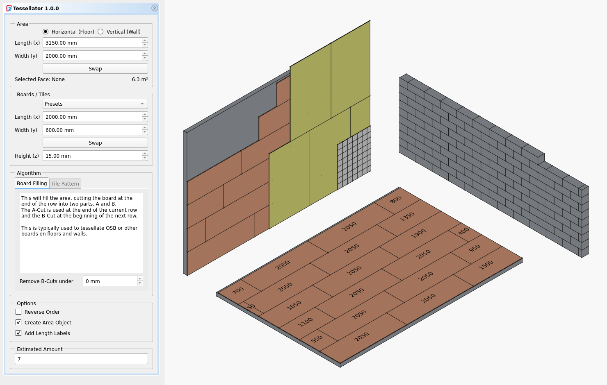
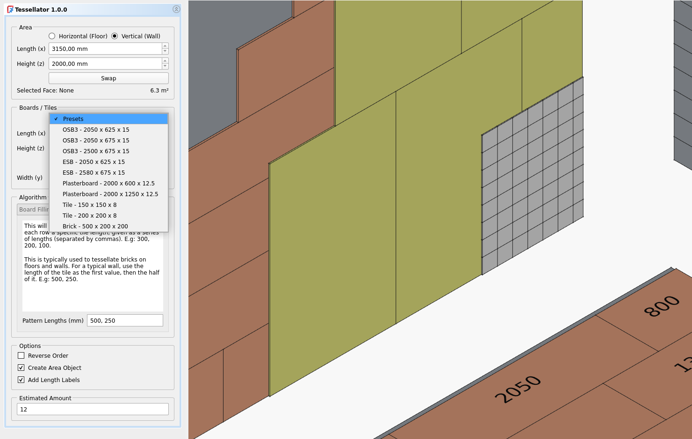
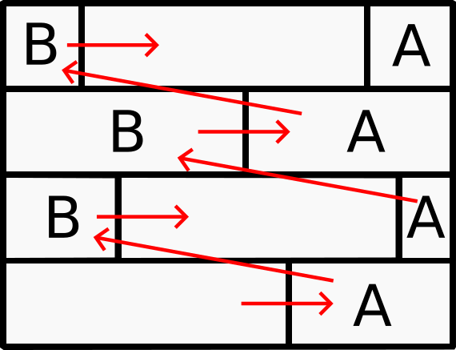
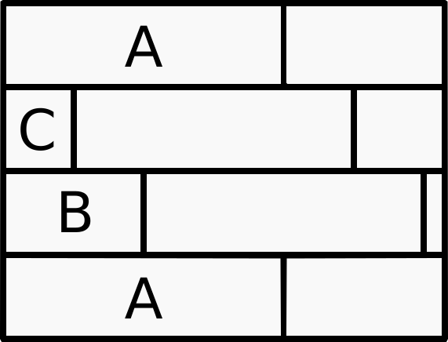

# FreeCAD Tessellator
A FreeCAD BIM macro to fill up areas with boards or generate tile patterns.

## Install:
Copy (unzip if needed) "Tessellator.FCMacro" and the folder "Tessellator" into FreeCAD's Macro folder.

To find it out, open FreeCAD, Menu "Macro" -> "Macros" -> "User macros location:". [More Info](https://wiki.freecad.org/How_to_install_macros)

It is really recommended to create an shortcut on a toolbar (use the icon file in the "Tessellator" folder). [More Info](https://wiki.freecad.org/Customize_Toolbars)

## Usage:
**Warning:** Because Tessellator creates a lot of objects, it is recommended to use it rather in studies (create a new project of a specific floor/wall to figure out the board amounts and the cuttings) than on big BIM projects.

**Info:** Tesselator will remember the latest used values.

1. Choose between "Horizontal (Floor)" and "Vertical (Wall)". 
2. Enter the area's length and width/height. If a surface is selected, Tessellator will try to fill it automatically (swap if needed).
3. Enter the board/tile measurements or select a preset.
4. Choose the algorithm: 
    * **"Board Filling"** if you want to fill the area with boards like OSB or plasterboards.
    * **"Tile Pattern"** if you want to fill the area with a specific row starting sequence (like for tiles ar a wall of bricks).
5. "Reverse Order" will reverse the generation order. Useful for floors, but not recommended for walls.
6. "Create Area Object" will create a dummy area object (not really needed if you already have it selected in your project)
7. "Add Length Labels" will create a label on each board showing it's length. Really useful for the Board Filling algorithm, so you will know exactly where to cut each board.
8. "Estimated Amount" will try to (slightly over-) estimate the amount of boards/tiles needed. This is the amount of objects which are going to be generated (be careful with high numbers!).

## Algorithms:

### Board Filling

This will fill up the area, cutting the board at the end of the row into two parts, A and B.
The A-Cut is used at the end of the current row and the B-Cut at the beginning of the next row.

This is typically used to tessellate OSB or other boards on floors and walls.

### Tile Pattern
This will fill up the area, using at the beginning of each row a specific tile length, given as a series of lengths (separated by commas). E.g: 300 (A), 200 (B), 100 (C).

This is typically used to tessellate bricks on floors and walls. For a typical wall, use the length of the tile as the first value, then the half of it. E.g: 500, 250.

